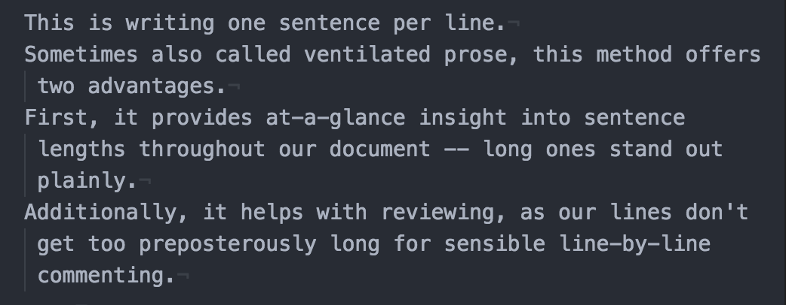
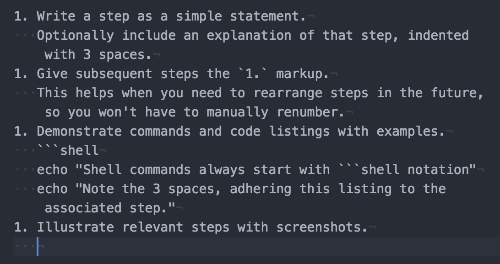

= Technical Documentation Style Guide
:toc: preamble

When documenting technical specifications and instructions for public presentation (and to a great extent for internal use, as well), clarity and consistency are imperative. Toward this end, this Style Guide can be used to standardize and elucidate terms and documentary concepts.

This is a living document. You are encouraged to comment on and contribute to it.

[[grammar]]
== Grammar

Oxford comma::
Place a comma before _and_ and _or_ at the end of a series of items.
Use it, embrace it, and love it.

Compound modifiers::
link:https://en.wikipedia.org/wiki/Compound_modifier[Compound modifiers] should be hyphenated to avoid confusion.
So “code that is open source” is “open-source code”.

=== Compound Modifiers


[[formatting]]
== Formatting

=== One Sentence Per Line

Place a single line break at the end of each sentence.
Rendering engines will automatically replace this with a space.

[source,markdown]
----
This is writing one sentence per line.
Sometimes also called ventilated prose, this method offers two advantages.
First, it provides at-a-glance insight into sentence lengths throughout our document -- long ones stand out plainly.
Additionally, it helps with reviewing.
Lines won't get too preposterously long for sensible line-by-line commenting, where no line breaks are used within paragraphs.
But they also won't require arbitrary breaks at line 80 or 90, which forces manual reflowing of paragraphs in the editor.
----

This method works best if you use an editor that enables a hanging indent, so each new sentence starts flush with the left margin.
Yet each subsequent line the sentence soft-wraps onto indents one space from the margin.



If you are unconvinced, link:https://asciidoctor.org/docs/asciidoc-recommended-practices/#one-sentence-per-line[read this].

[[literals]]
=== Literals

Used to express an exact technical name or value signifying a digital entity (ex: a path or filename, an explicit terminal command, a specific value, or a system user), _literals_ are formatted in monospace font.

Unix user and group names are literals.

* `root`, `admin`, `smartin`
* `staff`, `sysadmins`

Computer addresses, such as domain names, IP addresses, hostnames, and service ports are always literals.

* `127.0.0.1:5000`
* `okera.com`
* `something.example.com:4000`
* SSH listens at port `22`

==== Tokens in Examples

We use `<token_name>` formatting as placeholders for users to fill in their own data.
Always lowercase, with underscores to separate words and hyphens, colons, or dots only where literal.

* `<host>:<port>` to indicate you want the user to fill in a host and port
* `<host-port>` only where `host-port` is a property namespace the user will recognize

[[exceptions]]
==== Exceptions

One exception to this rule is *screen representations*, such as form-field labels. As with other page elements, use bold text to identify form field labels, but literals to refer to form-field values.

.Form and page element labels
====
In the *Site URL* field, enter the fully qualified website address (ex: `http://cerebrodata.com`).
====

See <<interface-elements>> for more on these representations.

Outside of specific instructions or code examples, *element types* and *data types* are also not to be treated as literals.
They are typically relayed in normal font.

.Element and data types
====
The input field labeled *Groups* accepts a string.
====

When referencing data types, conform to the case conventions for the language (e.g., string vs String).

REST request methods, such as POST, GET, DELETE, etc are listed in all-caps, but only expressed as literals when instructing their use in code.

.REST request methods
====
This API call is a POST method, so use `POST` in your code.
====

=== Instruction Steps

Write instruction steps with purpose.
When they are brief, they should be numbered.
When they are heavy or involved, they may deserve third- or fourth-tier headings, always starting with a number.

In Markdown, format numbers like so:

[source,markdown]
----
1. Write a step as a simple statement.
   Optionally include an explanation of that step, indented with 3 spaces.
1. Give subsequent steps the `1.` markup.
   This helps when you need to rearrange steps in the future, so you won't have to manually renumber.
1. Demonstrate commands and code listings with examples.
   ```shell
   echo "Shell commands always start with triple-backtick notation followed by the word shell"
   echo "Note the 3 spaces, adhering this listing to the associated step."
   ```
1. Illustrate relevant steps with screenshots.
   !(assets/images/docs-style-instruction-steps.png)
----

====
. Write a step as a simple statement.
+
Optionally include an explanation of that step, indented with 3 spaces.

. Give subsequent steps the `1.` markup.
+
This helps when you need to rearrange steps in the future, so you won't have to manually renumber.

. Demonstrate commands and code listings with examples.
+
[source,shell]
echo "Shell commands always start with triple-backtick notation followed by the word shell"
echo "Note the 3 spaces, adhering this listing to the associated step."

. Illustrate relevant steps with screenshots.
+

====

See <<examples-and-code-listings>> for more about formatting.

==== Conditional Instructions

When indicating that an instruction or description applies only under certin circumstances, place an _if_ statement at the front of the sentence and emphasize it with italics.

.Conditional description
====
2. _If you have ALL access on a particular object_ in the Okera UI, you have access to its admin features.
====

==== Goal-prompted instructions

Similarly to conditions, always place _in order to_ statements up front, this time without italics.
Let the user know what they're about to do before telling them to do it.

.Instruction preceded by a goal statement
====
. To bootstrap the cluster, run the script.
====

If the goal of an instruction is not relevant, leave it out.
If the explanation is informative but not critical, make it a separate sentence, following any code listings or examples.

.Instruction followed by a goal explanation
[]
----
1. Extract the Deployment Manager tarball.
   ```shell
   sudo mkdir -p /opt/cerebro && cd /opt/cerebro
   ```
   This command changes your pwd to the new directory.
----

=== Interface Elements

Labels of items in user interfaces are typically bolded in docs.
The case should generally match that of the label it is referencing, unless the label is all caps in the UI, in which case change it to initial caps to avoid being obnoxious.
Do not bold or capitalize the interface element type associated with the label, even though this is technically improper syntax for named nouns.
For instance: the *Access* tab; not: the *Access* Tab; and not: the *Access tab*.

.Bold to emphasize the name of a page name
====
After logging in, you land on the *Home* page.
====

=== Emphasis in Text

Use bold text to highlight the subject or topic of a section, or to introduce key terms.

.Bold to highlight components mentioned in text
====
This includes both the **Schema Registry** for creating, altering, or dropping various objects, as well as the **Policy Engine** for granting or revoking access related to all registered objects.
====

Also use bold to highlight where new features or functionality are introduced without their own section heading.

.Bold to highlight functionality
====
Use the Access tab to also *compare two different sets of groups' access* by selecting different sets of groups in the two different access columns.
====

(In the above example, _Access_ is capitalized because it is the name of a UI element, but it is not bolded because it has been previously introduced within this section of text.)

Use italics to highlight distinctions in text that may not be objects but rather factors or outcomes, minimizing the amount of text emphasized to the crux of the point.
This helps readers evaluate what they might want to review more closely as they skim.

.Italics to draw the eye to distinct factors or outcomes
====
Your credentials are saved in the browser until either your _token expires_, or you explicitly _log out_.
====

[[proper-nouns]]
=== Proper Nouns

Third-party products and packages (ex: “Spark”, “HDFS”, “Kubernetes”) are capitalized, except as part of a technical element that is obviously a literal, such as settings, files, or directories named after them, or their corresponding UNIX/system user. Ex: “the `hdfs` user”.

The **other exception** to this capitalization rule for products and packages is small packages for languages like Go, Python, JavaScript, and Ruby, which are notiriously lowercased.
Favor the peculiarities of the package authors, to the best of your availability, and do not literalize lowercased packages.
So, pip will always be pip (never `pip`), curl will be curl, and PyPA always PyPA.
Except Pip or Curl at the beginning of a sentence or in a heading.

In any document, the first local appearance of a third-party product should include its maker, e.g., Apache Hive.

See <<terms-and-components>> for explicit listings regarding spelling and contextualization of commonly used proper nouns.

== Structure

=== Titles & Headings

Titles and section headings are title case.

Block headings, such as example titles (required) or admonition titles (optional) are sentence case.

Captions are complete sentences in sentence case.

=== Admonitions

Markdown is not a very semantic format, so we have to fake some page elements, such as admonitions, which come in the form of warnings, tips, and notes.
Brief (one-sentence) admonitions are handled slightly differently than longer ones.

[source,markdown]
----
> **Warning:** A short admonition (note the colon).
----

[source,markdown]
----
> **Warning**
>
> A longer admonition.
Note the lack of a colon and the extra line.
----

Admonitions can be `**Note:**`, `**Tip:**`, or `**Warning:**`.
Each will be rendered in its own style to stand out from the page.

The output is set up to render these as admonition blocks, something like:

.Example admonition
====
[WARNING]
.Warning
A longer admonition.
Note the lack of a colon and the extra line.

====

[[terms-and-components]]
== Terms and Components

The following glossary standardizes word usage across Okera documentation.
Please use it when writing or editing technical docs.
Styles in use for marketing copy may vary.

=== Okera Components

[.dl-horizontal.glossary]
Okera Active Data Access Platform:: The proper, complete name of our product suite.

Okera Catalog, the Catalog:: Never _the Okera Catalog_, and never lowercase when referring to the component.

ODAS, Okera Data Access Service:: Never _the ODAS_ or _the Okera Data Access Service_. Never _ODAS service_ (refer to the running service by its process namespace like _`odas` service_ or else _ODAS daemon_ to indicate you're talking a literal Linux service, not just the functionality provided by ODAS).

Okera Portal:: The Okera web application, formally _WebUI_ or _Web UI_.

=== General Terms

[.dl-horizontal.glossary]
CDH:: CDH is Cloudera’s Hadoop distribution. See also, _Hadoop_.
_Cloudera CDH_ on first mention.

cluster-local:: Always hyphenated, referring to network connections and environments that treat clustered nodes as local.

comma-separated:: Always hyphenated, preferable to _comma-delimited_.

config vs configuration:: A _config_ is an actual configuration file or a reference to a given system's specific configuration definition.
_Configuration_ is the act of defining a aystem's setup.
Example (that you'd never actually write): “Configuration is defined by the config, `settings.xml`.”
Do not use _configs_ interchangably with settings; _configs_ implies multiple configuration files.

DataNode:: Always camel case in the Hadoop context.

diagnostic bundle:: Often misstated _diagnostics bundle_, the singular is preferred to stay consistent with Cloudera terminology.

full text / full-text:: Only and always hyphenate as a modifier, ex: “full-text search”, but “search the full text”.

Hadoop:: _Apache Hadoop_ on first mention. Use _Hadoop_ to convey introductory meaning (ex: Okera integrates with your existing Hadoop infrastructure”), but defer to _CDH_ (Cloudera’s Hadoop distribution) when in specific instructions (ex: Okera requires CDH 5.4 or higher.”)

large scale / large-scale:: Only and always hyphenate as a modifier, ex: “large-scale operation”, but “operating on a large scale”.

NameNode:: Always camel case in the Hadoop context.

OAuth:: The authentication standard.

open source / open-source:: Some “code is open source”, which makes it “open-source code”.

real time / real-time:: Unhyphenated as an object, ex: “carried out in real time”, hyphenated as a modifier “a real-time processor”. Never _realtime_.

self service / self-service:: Always hyphenated as compound modifier.

stdin / stdout / stderr:: Always lowercase.

Unix:: Never _UNIX_ unless referring to an actual distribution of the trademarked UNIX operating system. (You're not.)

users:: Always express specific operating system usernames as literals.

third party / third-party:: Only and always hyphenate as a modifier, ex: “third-party software”, but “software from a third party”.

ZooKeeper:: _Apache ZooKeeper_ on first mention. Always upper camelcase except in literals.

=== Special Terms

==== Hosts, Nodes, and More

Avoid using the terms _host_, _server_, _node_, and _machine_ without distinction.
Each has a nuanced definition and should be used appropriately.

[.dl-horizontal.glossary]
host:: An entity that runs server software (box, instance, container, etc)

machine:: A physical computer, usually 1:1 with a host

node:: A host operating in a cluster or a specific network of hosts

instance:: A host operating on a virtualized system, such as Amazon's EC2; not necessarily 1:1 to a machine

service:: A software process that performs a function for and/or serves data to locally running processes or remote clients

We typically refer to a _host_ when we're referencing what could either be a machine or an instance that has not yet been integrated into a cluster.
That same entity becomes a _node_ once it's integrated into an assembly of nodes.

It is not a good idea to use _server_ to refer to a host, machine, or node, nor to software that provides services to _client_ software.
Instead, use _service_ to indicate a process clients interface with.

A _machine_ should be used when it could be a host or a local computer.
For instance, “You'll need to perform this for any machine you want to run the odacm tool,” since the tool can be run on your laptop or on the Deployment Manager host.

Here are some terms that should typically conform as written.

* EC2 _instance_
* Deployment Manager _node_
* Catalog _service_

=== Examples and Code Listings

Offer example code as often as possible.
Rather than including a description of or introduction to an example in the preceding paragraph, place it in a title line for the example, like so:

[source,markdown]
----
**Example:** A code listing that will demonstrate examples
```shell
echo "This is for you to see how to make a code listing with an example heading."
```
----

==== CLI Listing Format

A command-line interface involves carefully named elements, starting with.
[source,shell]
----
prompt$ command --option argument
----

Shell commands are displayed Markdown like so:

[source,markdown]
---
```shell
command --option argument
```
---

When the listing is an example, make this explicit with `**Example:**` prepending a short description of the conents.
For example...

[source,markdown]
----
**Example:** Creating views with an explicit partitioning clause
```sql
CREATE VIEW v as SELECT ... FROM base_tbl
PARTITIONED BY c1
```
----

Include a command prompt when it is relevant, especially outside the Bash or standard shell environment.
Also use the `$` command prompt symbol for Bash commands on pages mixed shells/environments.

[source,markdown]
----
```shell
$ ./presto --server localhost:8080 --catalog hive --schema default
presto> show catalogs;
```
----

Use `\` to wrap long lines in descriptive command templates containing placeholder tokens, where we want users to see the whole command without scrolling horizontally.

[source,markdown]
----
```shell
cerebro_cli clusters update \
 --terminationProtectionEnabled=<true|false> <cluster_id>
```
----

For actual commands or expressed examples (without placeholder tokens), leave commands to one line:

[source,markdown]
----
```shell
cerebro_cli clusters update --terminationProtectionEnabled=true 5
```
----

When rendered for Web, this will scroll horizontally.
